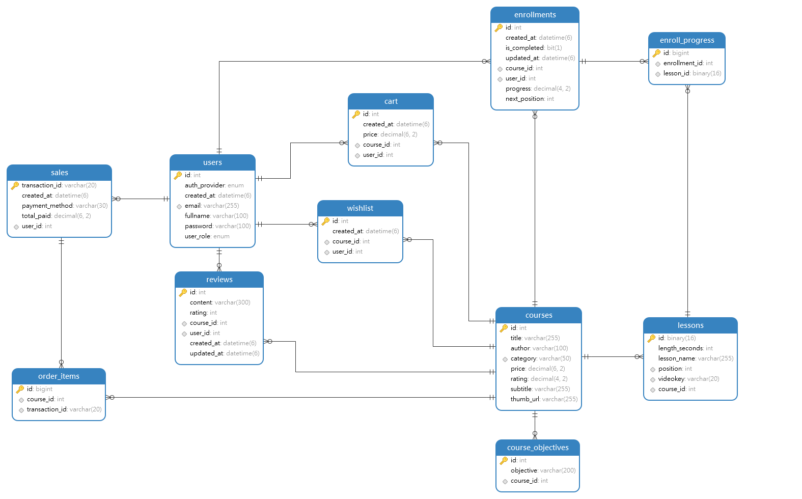

# Getting Started

### Reference Documentation
For further reference, please consider the following sections:

* [Official Apache Maven documentation](https://maven.apache.org/guides/index.html)
* [Spring Boot Maven Plugin Reference Guide](https://docs.spring.io/spring-boot/docs/2.7.13/maven-plugin/reference/html/)
* [Create an OCI image](https://docs.spring.io/spring-boot/docs/2.7.13/maven-plugin/reference/html/#build-image)
* [Deploying SpringBoot apps](https://docs.spring.io/spring-boot/docs/current/reference/htmlsingle/#deployment)
* [Spring Web](https://docs.spring.io/spring-boot/docs/2.7.13/reference/htmlsingle/#web)
* [Spring Data Redis (Access+Driver)](https://docs.spring.io/spring-boot/docs/2.7.13/reference/htmlsingle/#data.nosql.redis)
* [Spring Data JPA](https://docs.spring.io/spring-boot/docs/2.7.13/reference/htmlsingle/#data.sql.jpa-and-spring-data)
* [Spring Configuration Processor](https://docs.spring.io/spring-boot/docs/2.7.13/reference/htmlsingle/#appendix.configuration-metadata.annotation-processor)
* [Spring Session](https://docs.spring.io/spring-session/reference/)
* [Spring Security](https://docs.spring.io/spring-boot/docs/2.7.13/reference/htmlsingle/#web.security)
* [OAuth2 Client](https://docs.spring.io/spring-boot/docs/2.7.13/reference/htmlsingle/#web.security.oauth2.client)
* [Validation](https://docs.spring.io/spring-boot/docs/2.7.13/reference/htmlsingle/#io.validation)

### Guides
The following guides illustrate how to use some features concretely:

* [Building a RESTful Web Service](https://spring.io/guides/gs/rest-service/)
* [Serving Web Content with Spring MVC](https://spring.io/guides/gs/serving-web-content/)
* [Building REST services with Spring](https://spring.io/guides/tutorials/rest/)
* [Messaging with Redis](https://spring.io/guides/gs/messaging-redis/)
* [Accessing Data with JPA](https://spring.io/guides/gs/accessing-data-jpa/)
* [Accessing data with MySQL](https://spring.io/guides/gs/accessing-data-mysql/)
* [Securing a Web Application](https://spring.io/guides/gs/securing-web/)
* [Spring Boot and OAuth2](https://spring.io/guides/tutorials/spring-boot-oauth2/)
* [Validation](https://spring.io/guides/gs/validating-form-input/)
* [Braintree Payments](https://developer.paypal.com/braintree/docs/start/hello-server/java)
* [JPA Buddy](https://jpa-buddy.com/) - ✨ useful extension for IntelliJ Ultimate IDE, when working with JPA + Hibernate 

## Database Setup Info

### MySQL 8.0.x

This is the primary database. All DateTimes are stored and queried in UTC only. (**Hint: USE `java.time.Instant` as Type
for all Datetime fields**). Handle timezone conversion on your Frontend! For your convenience, I have included a
[mysqldump file](src/main/resources/data_wedemy.sql) which contains sample data for testing. 

- CREATE new schema called `wedemy` (any name is OK), with charset `utf8mb4`.
- Springboot will create all tables and indexes automatically on the Very First launch.
- To maintain consistent time-zone (UTC) with your Java server, ensure your JDBC connection URL has
  parameter `connectionTimeZone=UTC`. See example below. For native @Query's, use UTC_TIMESTAMP() or UTC_DATE().

  ```properties
  spring.datasource.url=jdbc:mysql://localhost:3306/wedemy?connectionTimeZone=UTC
  # OR, set this
  spring.jpa.properties.hibernate.jdbc.time_zone=UTC
  ```
Here is the ERD Diagram for MySQL Db used in the project:

.

### Redis v6.0 (or higher)

This project uses Redis for 2 main tasks: Caching, and Storing login sessions. You can download latest Redis (macOS &
Linux) from https://redis.io/download. Windows users may download the latest native installer (.msi)
from [this GitHub repo](https://github.com/tporadowski/redis/releases). Alternatively, you could pull its official
Docker image.
Another option you could try is Redis Cloud at: https://redis.com/try-free/. Remember to replace Redis credentials
inside application.yml (or in your ENV variables).

| Tip 💡 | Redis now has an OFFICIAL cross-platform desktop GUI client: RedisInsight. Download it free [here](https://redis.com/redis-enterprise/redis-insight/) |
|--------|:------------------------------------------------------------------------------------------------------------------------------------------------------|
